# Diagramas de Fluxo - TCG Tool

## Visualização dos Diagramas

Os diagramas abaixo utilizam a sintaxe Mermaid. Para visualizá-los:
- **GitHub**: Renderiza automaticamente
- **VS Code**: Extensão "Markdown Preview Mermaid Support"
- **Online**: https://mermaid.live

---

## 1. Arquitetura Geral do Sistema

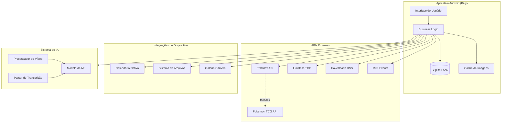

---

## 2. Navegação Principal do App

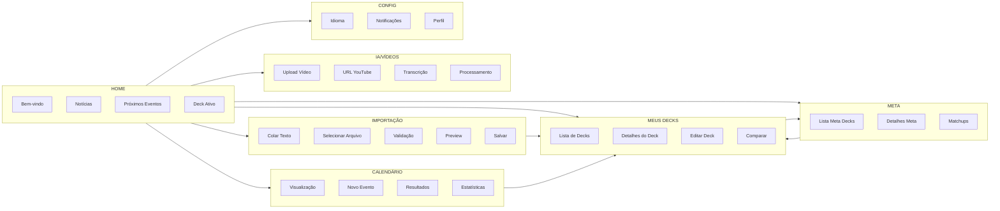

---

## 3. Fluxo de Importação de Deck

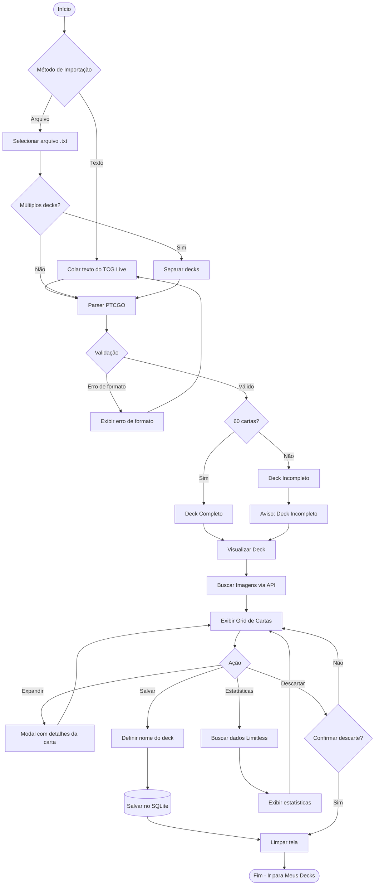

---

## 4. Fluxo de Criação/Edição de Deck

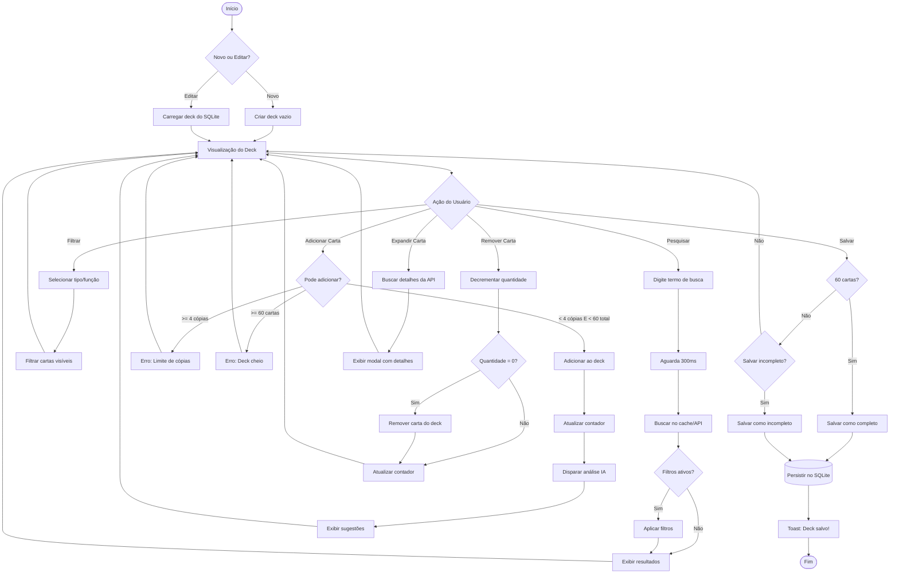

---

## 5. Fluxo de Comparação de Decks

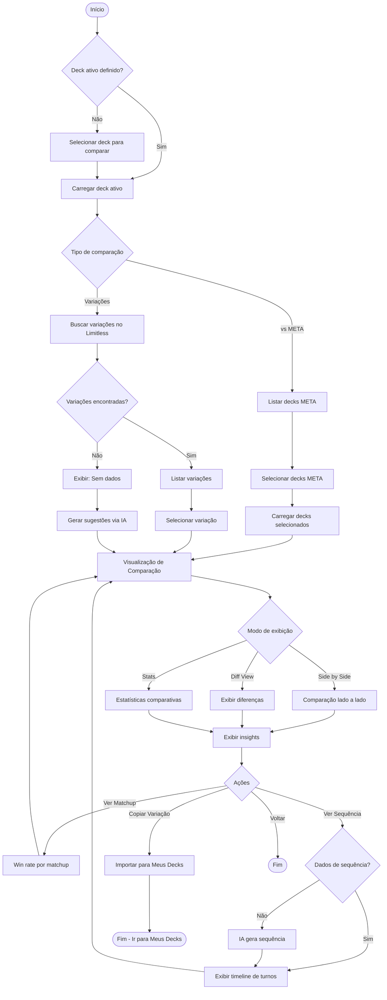

---

## 6. Fluxo de Processamento de Vídeo/IA

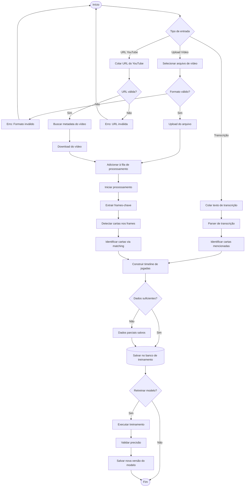

---

## 7. Fluxo de Calendário e Eventos

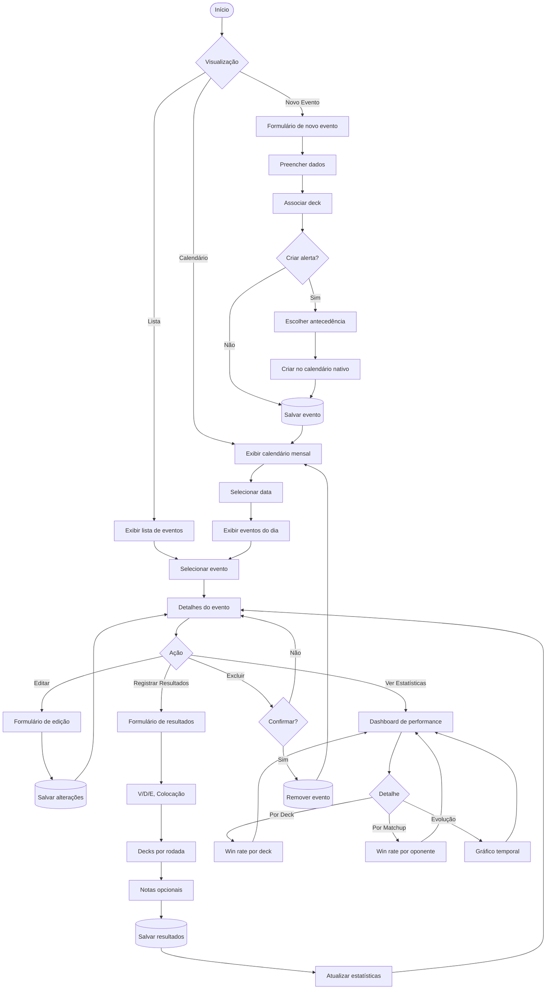

---

## 8. Fluxo de Transição de Tela (Samsung Fold 6)

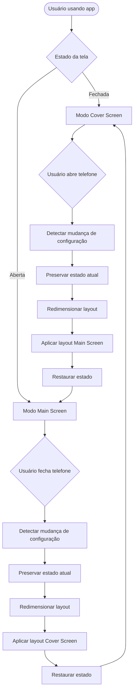

---

## 9. Modelo de Dados (ER Simplificado)

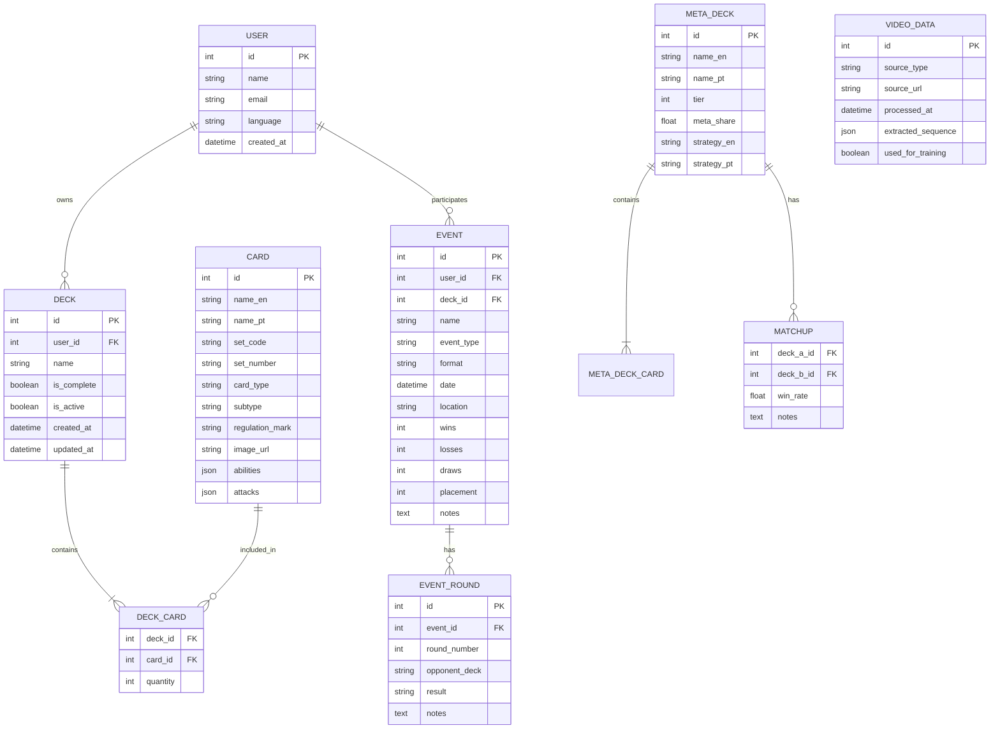

---

## 10. Sequência de API Calls - Busca de Carta

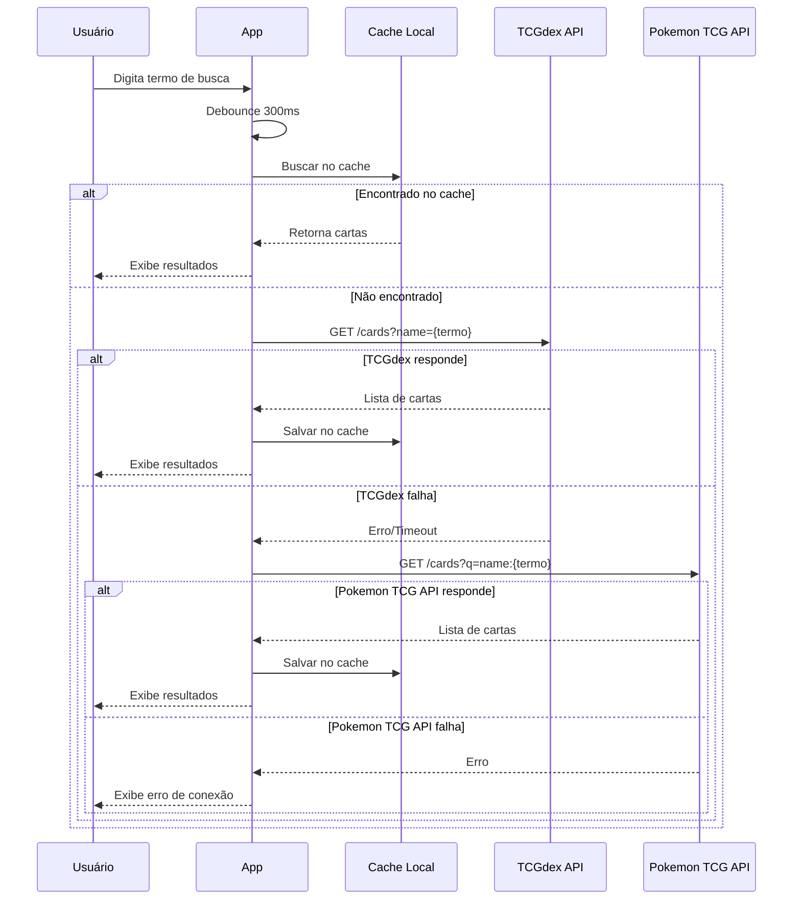

---

## 11. Estados da Interface - Deck Ativo

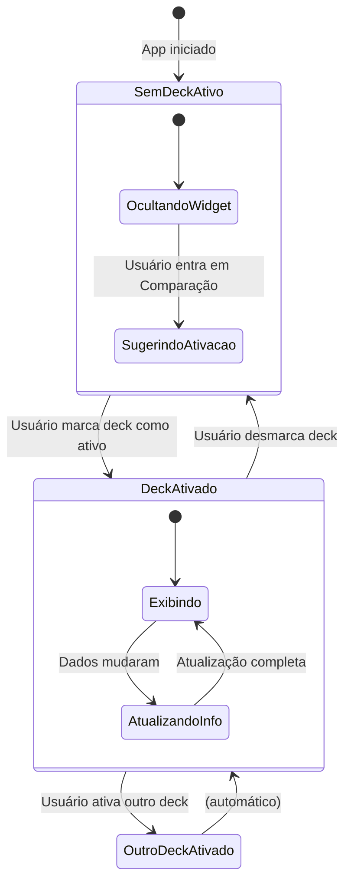

---

## Legenda dos Diagramas

### Formas

| Forma | Significado |
|-------|-------------|
| `([texto])` | Início/Fim |
| `[texto]` | Processo |
| `{texto}` | Decisão |
| `[(texto)]` | Banco de dados |
| `(texto)` | Estado |

### Setas

| Seta | Significado |
|------|-------------|
| `-->` | Fluxo principal |
| `-.->` | Fluxo alternativo/fallback |
| `-->>` | Resposta/Retorno |

### Cores (quando renderizado)

| Cor | Significado |
|-----|-------------|
| Verde | Sucesso/Caminho feliz |
| Vermelho | Erro/Falha |
| Amarelo | Aviso/Atenção |
| Azul | Informação/Processo |

---

*Documento gerado em 2026-02-01*
*Atualizado em 2026-02-02*
*Autor: Bruno Strumendo*
*Ferramenta: Mermaid.js*
*Status: Implementado - v2.0*
